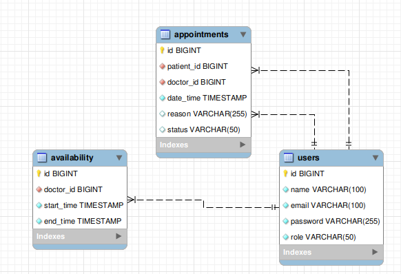

# **Sistema de Gestión de Citas**

## **Descripción del Proyecto**
El proyecto es una solución completa para la gestión de citas y disponibilidad de horarios. Desarrollado utilizando **Java** y el framework **Spring Boot**, este sistema facilita la reserva de citas, gestión de usuarios y administración de horarios. Además, implementa autenticación y autorización mediante **JWT (JSON Web Tokens)** para garantizar la seguridad y privacidad de los datos.

---

## **Características Principales**
- **Autenticación Segura**: Inicio de sesión y autorización utilizando JWT.
- **Gestión de Usuarios**: Registro, autenticación y asignación de roles (administrador o usuario).
- **Gestión de Disponibilidad**: Configuración y consulta de horarios disponibles.
- **Gestión de Citas**: Creación, consulta y cancelación de citas.
- **Arquitectura Modular**: Organización en capas que separa controladores, servicios, repositorios y DTOs para mayor escalabilidad.

---

## **Requisitos del Sistema**
- **Java**: JDK 17 o superior.
- **Maven**: Para la gestión de dependencias y construcción del proyecto.
- **Base de Datos MySQL**: Para almacenar usuarios, citas y disponibilidades.
- **Git**: Para clonar y gestionar el repositorio.
- **Postman o cURL**: Para realizar pruebas de los endpoints (opcional).

---

## **Configuración y Ejecución**

### **1. Clonar el Repositorio**
```bash
git clone <URL_DEL_REPOSITORIO>
cd assessment
```

### **2. Configurar las Variables de Entorno**
Crea un archivo `.env` en el directorio raíz con el siguiente contenido:
```env
DB_URL=jdbc:mysql://localhost:3306/assessment
DB_USER=tu_usuario
DB_PASSWORD=tu_contraseña
JWT_SECRET=clave_secreta_para_jwt
```

### **3. Instalar Dependencias**
Ejecuta el siguiente comando para instalar las dependencias:
```bash
mvn clean install
```

### **4. Configurar la Base de Datos**
Importa el archivo `schema.sql` ubicado en `src/main/resources/` para crear la estructura inicial de la base de datos.

### **5. Iniciar la Aplicación**
```bash
mvn spring-boot:run
```

### **6. Probar la API**
La API estará disponible en [http://localhost:8080](http://localhost:8080).

---

## **Estructura del Proyecto**

```
assessment/
├── src/main/java/com/assessment/
│   ├── controller/        # Controladores REST
│   ├── service/           # Lógica de negocio
│   ├── repository/        # Repositorios JPA
│   ├── model/             # Entidades JPA
│   ├── dto/               # Objetos de Transferencia de Datos
│   └── config/            # Configuración de seguridad y JWT
├── src/main/resources/
│   ├── application.properties  # Configuración de Spring Boot
│   ├── schema.sql              # Script para la base de datos
│   └── modeloEntidaRelacion.png # Diagrama E/R de la base de datos
├── pom.xml               # Archivo de configuración de Maven
└── README.md             # Documentación del proyecto
```

---

## **Casos de Uso**

### **1. Autenticación**
**Objetivo**: Permitir a los usuarios iniciar sesión de forma segura y acceder a sus datos mediante un token JWT.

### **2. Gestión de Usuarios**
**Objetivo**: Permitir a los administradores gestionar los datos de los usuarios registrados.

### **3. Gestión de Citas**
**Objetivo**: Permitir a los usuarios consultar y reservar citas disponibles.

---

## **Diagrama Entidad-Relación**



---

## **Endpoints Principales**

### **Autenticación**
| Método | Endpoint         | Descripción               |
|--------|------------------|---------------------------|
| POST   | `/auth/register` | Registrar un usuario nuevo|
| POST   | `/auth/login`    | Autenticación             |

### **Gestión de Usuarios**
| Método | Endpoint   | Descripción                           |
|--------|------------|---------------------------------------|
| GET    | `/users`   | Listar todos los usuarios (admin)    |

### **Gestión de Citas**
| Método | Endpoint         | Descripción                       |
|--------|------------------|-----------------------------------|
| GET    | `/appointments`  | Consultar todas las citas         |
| POST   | `/appointments`  | Crear una nueva cita              |

### **Gestión de Disponibilidad**
| Método | Endpoint         | Descripción                       |
|--------|------------------|-----------------------------------|
| GET    | `/availability`  | Consultar disponibilidad          |
| POST   | `/availability`  | Crear una nueva franja disponible |

---

## **Ejemplo de Uso**

### **Registrar un Usuario**
- **Endpoint**: `POST /auth/register`
- **Payload**:
```json
{
  "username": "usuario123",
  "password": "password123"
}
```

### **Crear una Cita**
- **Endpoint**: `POST /appointments`
- **Headers**:
    - `Authorization: Bearer <token>`
- **Payload**:
```json
{
  "date": "2024-11-20T10:00:00",
  "userId": 1
}
```

---

